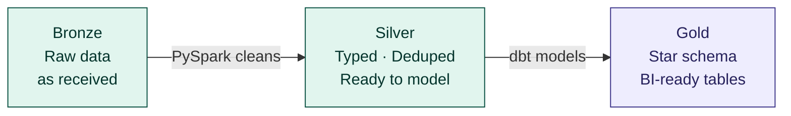
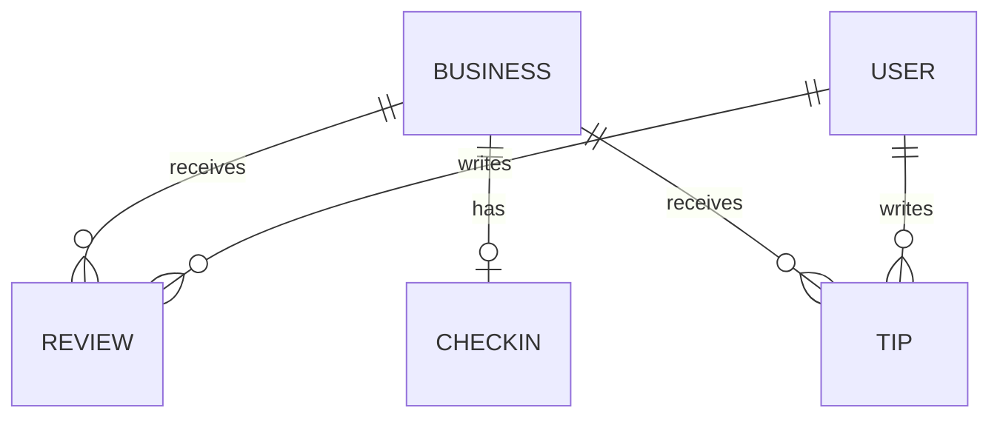
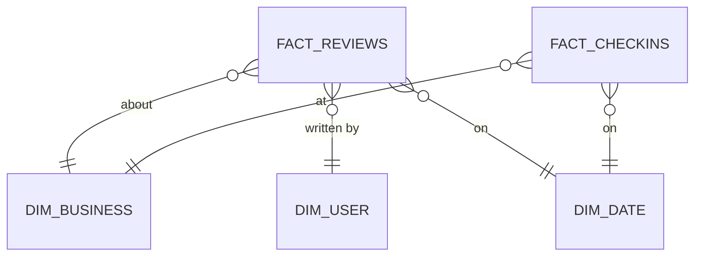

# Yelp Data Engineering Platform

A production-grade data pipeline that ingests the Yelp dataset, transforms it through three quality layers, and delivers a BI-ready star schema for business reporting and analytics.

**Built by:** Aamir | **Assessment:** Finalto Data Engineering

---

## What This Does — In Plain English

Yelp publishes a dataset of businesses, reviews, users, checkins, and tips as raw JSON files. This platform takes that raw data and turns it into clean, reliable tables that a BI team can query to answer real business questions — without ever needing to understand the messy source format.

```
Raw JSON files  →  Clean it  →  Model it  →  Business reports
```

---

## The Three-Layer Architecture

Every record passes through three layers before reaching a dashboard. Each layer has one job.



| Layer | What it does | Tool | Who reads it |
|---|---|---|---|
| **Bronze** | Stores raw data exactly as received. Never modified. | PySpark on EMR | Silver pipeline only |
| **Silver** | Fixes types, removes duplicates, flattens messy fields | PySpark on EMR | Gold (dbt) only |
| **Gold** | Final star schema — clean tables built for BI queries | dbt on Databricks | BI tools, analysts |

---

## Tech Stack

| Purpose | Tool | Why |
|---|---|---|
| Storage | AWS S3 + Delta Lake | ACID transactions, time travel, safe re-runs |
| Compute — Bronze + Silver | PySpark on Amazon EMR | Distributed processing for large files (5.5GB+ reviews) |
| Modelling — Gold | dbt on Databricks | SQL models with built-in tests, lineage docs, incremental builds |
| Orchestration | Apache Airflow (MWAA) | DAG-based pipeline with retry logic and SLA alerts |
| Serving | Amazon Athena | Serverless SQL directly on Gold Delta tables |
| Real-time (future) | Apache Kafka on MSK | Streaming extension — no pipeline redesign needed |

---

## The Dataset — 5 Source Entities

| File | Size | What it contains |
|---|---|---|
| `business.json` | ~120 MB | Every Yelp business — name, location, category, rating |
| `review.json` | ~5.5 GB | Every review ever written — stars, date, text, votes |
| `user.json` | ~3.5 GB | Every Yelp user — review history, Elite status |
| `checkin.json` | ~290 MB | Timestamped visits per business |
| `tip.json` | ~240 MB | Short user feedback with no star rating |

> `review.json` at 5.5GB is the dominant file and drives all partitioning and performance decisions.

---

## Data Model

### Source relationships



### Gold star schema — what BI queries



---

## Repo Structure

```
finalto/
│
├── data_engineering/
│   ├── ingestion/
│   │   └── bronze_ingestion.py        ← PySpark: raw JSON → Bronze Delta tables
│   │
│   ├── transformation/
│   │   └── silver_transform.py        ← PySpark: Bronze → Silver (clean & conform)
│   │
│   ├── data_engineering.md            ← Ingestion design, transformations, scalability
│   └── sql_design_task.md             ← Rising star query + all BI scenario queries
│
├── dbt/
│   ├── dbt_project.yml                ← dbt project config and materialisation settings
│   ├── profiles.yml                   ← Databricks connection (uses env vars)
│   ├── packages.yml                   ← dbt_utils dependency
│   ├── sources.yml                    ← Silver source table definitions
│   │
│   └── models/
│       ├── staging/                   ← stg_* models + staging.yml
│       ├── intermediate/              ← int_* models + intermediate.yml
│       └── marts/                     ← fact_* and dim_* models + marts.yml
│
├── docs/
│   ├── diagrams/
│   │   ├── data_flow_diagram.md       ← End-to-end pipeline flow diagrams
│   │   ├── data_lineage_diagram.md    ← Source-to-Gold field traceability
│   │   └── erd_diagram.md             ← Source ERD and Gold star schema ERD
│   │
│   └── architecture.md               ← Tech stack decisions and trade-offs
│
└── Readme.md
```

---

## Key Design Decisions

### Lookback window — catching late-arriving data

Every pipeline run re-processes the last **3 days**, not just today. This catches records that arrive in the source file late — common with large distributed systems like Yelp.

```
Run date: April 26  →  processes April 24, 25, 26
Re-running is safe — only those partitions are replaced, nothing else is touched.
```

### Idempotent pipelines — safe to re-run

Every job can be re-run for the same date without creating duplicates.
- Bronze → dynamic partition overwrite
- Silver → deduplicate on natural keys
- Gold → dbt incremental with unique key

### dbt tests — data quality before BI

Every Gold table has automated tests that run after every build. If any test fails, the pipeline stops — BI is never served invalid data.

| Test | What it catches |
|---|---|
| `not_null` | Critical columns can never be empty |
| `unique` | No duplicate primary keys |
| `relationships` | Every FK in a fact table must exist in its dimension |
| `accepted_values` | Star ratings must be 1.0 – 5.0 |

---

## BI Reporting Scenarios

Five questions this platform answers out of the box:

| # | Business question | Tables used |
|---|---|---|
| 1 | Top rated businesses by city and category | `fact_reviews` + `dim_business` + `dim_date` |
| 2 | Do Elite reviewers behave differently to regular users? | `fact_reviews` + `dim_user` |
| 3 | Which businesses are rising stars? | `int_rising_star_candidates` + `dim_business` |
| 4 | When is each type of business busiest? | `fact_checkins` + `dim_business` + `dim_date` |
| 5 | How has review volume and rating changed over time? | `fact_reviews` + `dim_date` |

---

## SQL — Rising Star Query

Finds businesses where the past-year average rating is at least 1 star higher than before, with a minimum of 10 recent reviews.

```sql
with recent as (
    select business_id,
           avg(review_stars)  as avg_stars_recent,
           count(review_id)   as review_count_recent
    from gold.fact_reviews f
    join gold.dim_date d on f.date_id = d.date_id
    where d.full_date >= dateadd(year, -1, current_date)
    group by business_id
),
historical as (
    select business_id,
           avg(review_stars)  as avg_stars_historical
    from gold.fact_reviews f
    join gold.dim_date d on f.date_id = d.date_id
    where d.full_date < dateadd(year, -1, current_date)
    group by business_id
)
select b.business_id,
       b.name,
       round(r.avg_stars_recent - h.avg_stars_historical, 2) as rating_improvement
from recent r
inner join historical h        on r.business_id = h.business_id
inner join gold.dim_business b on r.business_id = b.business_id
where r.review_count_recent    >= 10
  and r.avg_stars_recent       >= h.avg_stars_historical + 1.0
order by rating_improvement desc;
```

> Full query design and all BI scenario queries → `data_engineering/sql_design_task.md`

---

## How to Run

### Prerequisites
- Python 3.10+, PySpark 3.4+, AWS CLI configured
- dbt CLI with Databricks adapter — `pip install dbt-databricks`
- Yelp dataset downloaded from [Kaggle](https://www.kaggle.com/datasets/yelp-dataset/yelp-dataset) and uploaded to your S3 landing bucket

### Bronze ingestion
```bash
spark-submit data_engineering/ingestion/bronze_ingestion.py \
  --env prod --date 2026-04-26 --lookback 3
```

### Silver transformation
```bash
spark-submit data_engineering/transformation/silver_transform.py \
  --env prod --date 2026-04-26 --lookback 3
```

### Gold layer — dbt
```bash
cd dbt
dbt deps                         # install dbt_utils
dbt run --select staging         # build staging views
dbt run --select intermediate    # build intermediate models
dbt run --select marts           # build Gold fact and dim tables
dbt test                         # run all quality tests
dbt docs generate && dbt docs serve   # view lineage graph
```

---

## Further Reading

| Document | Location | What's inside |
|---|---|---|
| Architecture | `docs/architecture.md` | Full tech stack decisions, trade-offs, and alternatives |
| Data model | `data_engineering/data_engineering.md` | Every entity, every field, transformation logic, scalability |
| SQL queries | `data_engineering/sql_design_task.md` | Rising star query + 6 BI scenario queries |
| ERD | `docs/diagrams/erd_diagram.md` | Source ERD and Gold star schema ERD |
| Data flow | `docs/diagrams/data_flow_diagram.md` | Pipeline flow, Airflow DAG chain, Kafka extension |
| Data lineage | `docs/diagrams/data_lineage_diagram.md` | Field-level traceability from JSON to Gold column |

---

*Built with PySpark · dbt · Delta Lake · Apache Airflow · AWS*
