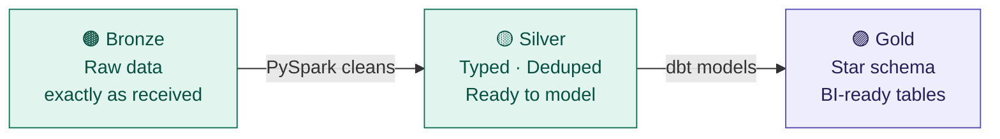
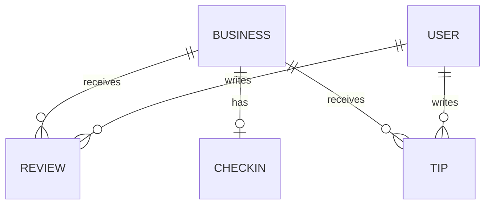
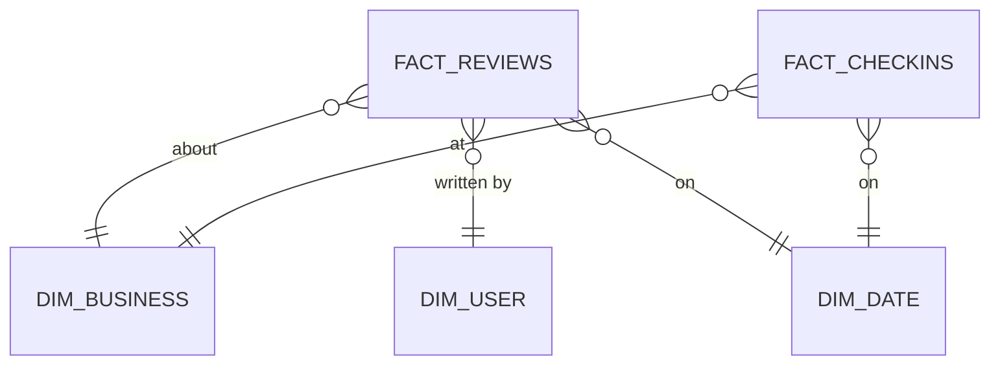

# Yelp Data Engineering Platform

A production-grade data pipeline that ingests the Yelp dataset, transforms it through three quality layers, and delivers a BI-ready star schema for business reporting and analytics.

**Built by:** Aamir | **Assessment:** Finalto Data Engineering

---

## What This Does — In Plain English

Yelp publishes a dataset of businesses, reviews, users, checkins, and tips as raw JSON files. This platform takes that raw data and turns it into clean, reliable tables that a BI team can query to answer business questions — without ever needing to understand the messy source format.

```
Raw JSON files  →  Clean it  →  Model it  →  Business reports
```

---

## The Three-Layer Architecture

Every record passes through three layers before reaching a dashboard. Each layer has one job and one job only.



| Layer | What it does | Tool | Who reads it |
|---|---|---|---|
| **Bronze** | Stores raw data exactly as it arrived. Never modified. | PySpark on EMR | Silver pipeline only |
| **Silver** | Fixes types, removes duplicates, flattens messy fields | PySpark on EMR | Gold (dbt) only |
| **Gold** | Final star schema — clean tables built for BI queries | dbt on Databricks | BI tools, analysts |

---

## Tech Stack

| Purpose | Tool | Why |
|---|---|---|
| Storage | AWS S3 + Delta Lake | ACID transactions, time travel, no data loss on re-runs |
| Compute (Bronze + Silver) | PySpark on Amazon EMR | Distributed processing for large JSON files (5.5GB+ reviews) |
| Modelling (Gold) | dbt on Databricks | SQL models with built-in tests, lineage docs, incremental builds |
| Orchestration | Apache Airflow (MWAA) | DAG-based pipeline with retry logic and SLA alerts |
| Serving | Amazon Athena | Serverless SQL directly on Gold Delta tables |
| Real-time (future) | Apache Kafka (MSK) | Event streaming extension — no redesign needed |

---

## The Dataset — 5 Source Entities

| File | Size | What it contains |
|---|---|---|
| `business.json` | ~120MB | Every Yelp business — name, location, category, rating |
| `review.json` | ~5.5GB | Every review ever written — stars, date, text, votes |
| `user.json` | ~3.5GB | Every Yelp user — review history, Elite status |
| `checkin.json` | ~290MB | Timestamped visits per business |
| `tip.json` | ~240MB | Short user feedback (no star rating) |

> `review.json` at 5.5GB is the dominant file and drives all partitioning and performance decisions.

---

## Data Model

### Source relationships



### Gold star schema (what BI queries)



---

## Repo Structure

```
yelp-data-engineering/
│
├── docs/
│   ├── architecture.md          ← Tech stack decisions and justifications
│   ├── data_model.md            ← Entity descriptions and field definitions
│   ├── data_engineering.md      ← Ingestion, transformation, scalability detail
│   ├── sql_design.md            ← All SQL queries (clean version)
│   ├── erd.md                   ← Entity relationship diagrams
│   ├── data_flow.md             ← End-to-end pipeline flow diagrams
│   └── data_lineage.md          ← Source-to-Gold field traceability
│
├── ingestion/
│   └── bronze_ingestion.py      ← PySpark: raw JSON → Bronze Delta tables
│
├── transform/
│   └── silver_transform.py      ← PySpark: Bronze → Silver (clean & conform)
│
├── tests/
│   └── pipeline_tests.py        ← Data quality tests (Bronze + Silver)
│
├── dbt/
│   ├── dbt_project.yml          ← dbt project config
│   ├── profiles.yml             ← Databricks connection
│   ├── packages.yml             ← dbt_utils dependency
│   ├── sources.yml              ← Silver source definitions
│   │
│   ├── models/
│   │   ├── staging/             ← stg_* models + staging.yml
│   │   ├── intermediate/        ← int_* models + intermediate.yml
│   │   └── marts/               ← fact_* + dim_* models + marts.yml
│   │
│   ├── tests/                   ← Custom singular tests
│   └── macros/                  ← Reusable SQL macros
│
└── README.md
```

---

## Key Design Decisions

### Lookback window — catching late-arriving data

Every pipeline run re-processes the last **3 days**, not just today. This catches records that arrive in the source file late (common with large distributed systems like Yelp).

```
Run date: April 26  →  processes April 24, 25, 26
Re-running is safe — only those partitions are replaced, nothing else is touched.
```

### Idempotent pipelines — safe to re-run

Every job can be re-run for the same date without creating duplicates. Bronze uses dynamic partition overwrite. Silver deduplicates on natural keys. Gold uses dbt incremental with a unique key.

### dbt tests — data quality before BI

Every Gold table has automated tests that run after every build:
- `not_null` — critical columns can never be empty
- `unique` — no duplicate primary keys
- `relationships` — every FK in a fact table must exist in its dimension
- `accepted_values` — star ratings must be 1.0–5.0

If any test fails, the pipeline stops. BI is never served invalid data.

---

## BI Reporting Scenarios

Five questions this platform can answer out of the box:

| # | Business question | Tables used |
|---|---|---|
| 1 | Top rated businesses by city and category | `fact_reviews` + `dim_business` + `dim_date` |
| 2 | Do Elite reviewers behave differently to regular users? | `fact_reviews` + `dim_user` |
| 3 | Which businesses are rising stars? | `int_rising_star_candidates` + `dim_business` |
| 4 | When is each type of business busiest? | `fact_checkins` + `dim_business` + `dim_date` |
| 5 | How has review volume and rating changed over time? | `fact_reviews` + `dim_date` |

---

## SQL — Rising Star Query

The assessment asks to find businesses with at least 10 recent reviews where the past-year average is 1+ star higher than before.

```sql
with recent as (
    select business_id,
           avg(review_stars)  as avg_stars_recent,
           count(review_id)   as review_count_recent
    from gold.fact_reviews f
    join gold.dim_date d on f.date_id = d.date_id
    where d.full_date >= dateadd(year, -1, current_date)
    group by business_id
),
historical as (
    select business_id,
           avg(review_stars)  as avg_stars_historical
    from gold.fact_reviews f
    join gold.dim_date d on f.date_id = d.date_id
    where d.full_date < dateadd(year, -1, current_date)
    group by business_id
)
select b.business_id,
       b.name,
       round(r.avg_stars_recent - h.avg_stars_historical, 2) as rating_improvement
from recent r
inner join historical h        on r.business_id = h.business_id
inner join gold.dim_business b on r.business_id = b.business_id
where r.review_count_recent    >= 10
  and r.avg_stars_recent       >= h.avg_stars_historical + 1.0
order by rating_improvement desc;
```

> Full SQL design and all BI queries → `docs/sql_design.md`

---

## How to Run

### Prerequisites
- Python 3.10+, PySpark 3.4+, AWS CLI configured
- dbt CLI with Databricks adapter (`pip install dbt-databricks`)
- Yelp dataset downloaded from [Kaggle](https://www.kaggle.com/datasets/yelp-dataset/yelp-dataset) and uploaded to your S3 landing bucket

### Bronze ingestion
```bash
spark-submit ingestion/bronze_ingestion.py --env prod --date 2026-04-26 --lookback 3
```

### Silver transformation
```bash
spark-submit transform/silver_transform.py --env prod --date 2026-04-26 --lookback 3
```

### Data quality tests
```bash
spark-submit tests/pipeline_tests.py --layer bronze --env prod
spark-submit tests/pipeline_tests.py --layer silver --env prod
```

### Gold layer (dbt)
```bash
cd dbt
dbt deps                        # install dbt_utils
dbt run --select staging        # build staging views
dbt run --select intermediate   # build intermediate models
dbt run --select marts          # build Gold fact and dim tables
dbt test                        # run all quality tests
dbt docs generate && dbt docs serve  # view lineage graph
```

---

## Further Reading

| Document | What's inside |
|---|---|
| `docs/architecture.md` | Full tech stack decisions, trade-offs, and alternatives considered |
| `docs/data_model.md` | Every entity, every field, every data quality issue and how it's handled |
| `docs/data_engineering.md` | Ingestion design, all transformation logic, scalability and monitoring |
| `docs/erd.md` | Source ERD and Gold star schema ERD |
| `docs/data_flow.md` | End-to-end pipeline flow, Airflow DAG chain, real-time extension |
| `docs/data_lineage.md` | Field-level traceability from JSON to Gold column |
| `docs/sql_design.md` | Rising star query + 6 BI scenario queries |

---

*Built with PySpark · dbt · Delta Lake · Apache Airflow · AWS*