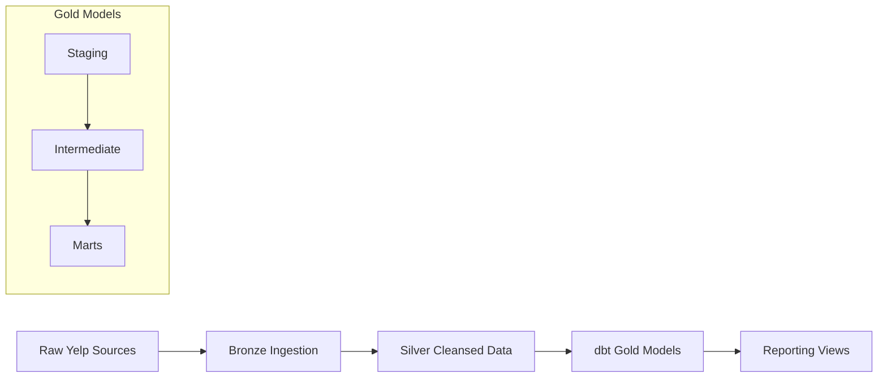
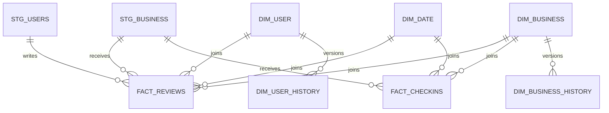

# Yelp Analytics Data Platform

End-to-end analytics engineering pipeline implementing Medallion architecture, dimensional modeling, incremental processing, anomaly testing, and business-facing reporting on Yelp data.

---

# Executive Summary

This project transforms raw Yelp source data into trusted analytical products through layered engineering:

Raw Sources  
→ Bronze Ingestion  
→ Silver Cleansed Data  
→ Gold Analytics Models  
→ Reporting Views

Supports both:

- Production-style engineering concerns  
- Business intelligence use cases

Key capabilities:
- Incremental fact processing
- SCD Type 1 and Type 2 dimensions
- Data quality and anomaly testing
- Reprocessing / recovery strategy
- BI-ready semantic reporting models

---

# 4-Layer Architecture



---

# Medallion Architecture

## Bronze
Immutable raw ingestion layer.

Responsibilities:
- Raw landing
- Schema drift handling
- Replay support
- Failure recovery

---

## Silver
Cleansed and standardized source entities.

Responsibilities:
- Deduplication
- Event normalization
- Data quality handling
- Check-in explosion to event grain

---

## Gold
dbt transformation layer:

- Staging
- Intermediate
- Star schema marts

---

## Reporting
Business-facing semantic models for BI consumption.

---

# Data Model



---

# dbt Model Layers

## Staging Models
Thin translation layer over Silver sources.

Materialization:
Views

Models:
- stg_reviews
- stg_business
- stg_users
- stg_checkins

Purpose:
- Rename source columns
- Light type casting
- Derived lightweight fields
- No business logic

---

## Intermediate Models
Reusable business logic models.

Materialization:
Ephemeral

### int_reviews_with_dates
Purpose:
Resolves `date_id` foreign key for fact_reviews.

Grain:
One row per review.

---

### int_business_categories
Purpose:
Derives primary business category from bridge table.

Grain:
One row per business.

---

### int_rising_star_candidates
Purpose:
Computes candidate businesses qualifying as “rising stars”.

Logic:
- Recent vs historical review windows
- Rating improvement >= 1.0
- Minimum 10 recent reviews

Grain:
One row per qualifying business.

---

# Gold Star Schema

## Fact Tables

### fact_reviews
Grain:
One row per review (`review_id`)

Measures:
- Review ratings
- Vote metrics
- Review length

Incremental model.

---

### fact_checkins
Grain:
One row per check-in event (`checkin_id`)

Incremental model.

---

## Dimensions

### dim_business
Current-state business dimension (Type 1)

---

### dim_user
Current-state user dimension (Type 1)

---

### dim_date
Date spine dimension

---

## Historical Dimensions

### dim_business_history
Type 2 business history.

Grain:
One row per business version.

---

### dim_user_history
Type 2 user history.

Grain:
One row per user version.

---

# Reporting Semantic Layer

Materialized as views in:

`gold_reporting`

## vw_rising_stars
Businesses with significant ratings improvement.

Use cases:
- Growth targeting
- Emerging business detection

---

## vw_top_businesses_by_city
City/category/year performance model.

Use cases:
- Regional benchmarking
- Top performer reporting

---

## vw_review_trends
Monthly review and sentiment trends.

Use cases:
- Platform growth analysis
- Executive trend reporting

---

# Data Quality

Validation includes:

## Schema Tests
- unique
- not_null
- accepted_values
- relationships

---

## Custom Tests
Includes:
- Fact grain violation tests
- Pipeline anomaly detection
- Volume drift checks
- Business rule assertions

---

# Reprocessing Strategy
Supports:

- Full refresh rebuilds
- Incremental replay
- Partition backfills

See:
`docs/data_engineering.md`

---

# Project Structure

```bash
.
├── ingestion/
│   └── bronze_ingestion.py
│
├── models/
│   ├── staging/
│   │   ├── stg_reviews.sql
│   │   ├── stg_business.sql
│   │   ├── stg_users.sql
│   │   ├── stg_checkins.sql
│   │   └── staging.yml
│   │
│   ├── intermediate/
│   │   ├── int_reviews_with_dates.sql
│   │   ├── int_business_categories.sql
│   │   ├── int_rising_star_candidates.sql
│   │   └── intermediate.yml
│   │
│   ├── marts/
│   │   ├── fact_reviews.sql
│   │   ├── fact_checkins.sql
│   │  ├── dim_business.sql
│   │  ├── dim_user.sql
│   │  ├── dim_date.sql
│   │  ├── dim_business_history.sql
│   │  ├── dim_user_history.sql
│   │  └── marts.yml
│   │
│   └── reporting/
│       ├── vw_rising_stars.sql
│       ├── vw_top_businesses_by_city.sql
│       ├── vw_review_trends.sql
│       └── reporting.yml
│
├── tests/
├── macros/
├── docs/
├── dbt_project.yml
└── README.md
```

---

# Tech Stack

| Layer | Technology |
|------|-------------|
Ingestion | Python |
Storage | Databricks Delta |
Transformations | dbt |
Modeling | SQL Star Schema |
Quality | dbt tests + custom tests |

---

# Run

```bash
python ingestion/bronze_ingestion.py
dbt build
dbt test
python tests/pipeline_tests.py
```

---

# Business Questions Supported

This platform supports:

- Which businesses are emerging rapidly?
- Which cities/categories outperform peers?
- How is platform engagement trending?
- What did business/user attributes look like at event time?