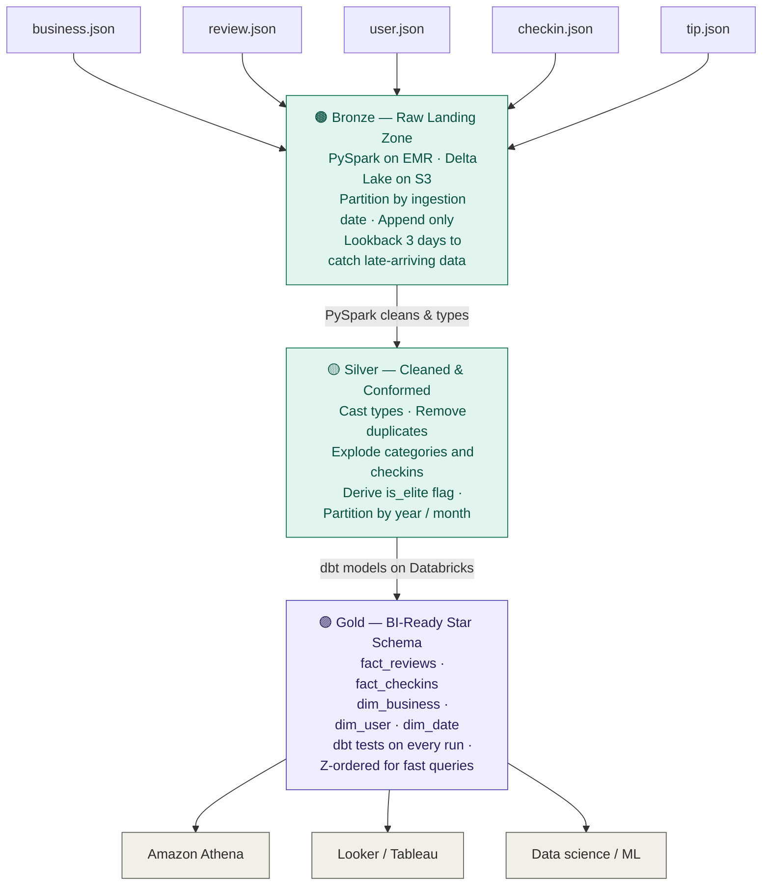
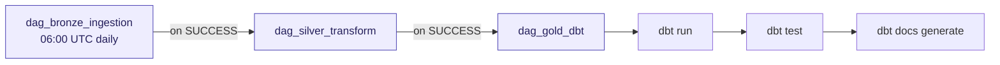
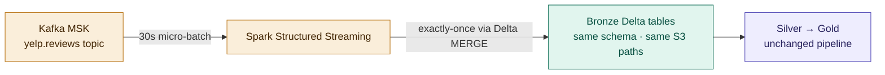

# Data Flow Diagram
## Yelp Data Engineering Platform — End-to-End Data Movement

---

---

## Airflow Orchestration Chain

**If any stage fails, the chain stops.** Silver never runs if Bronze fails. Gold never runs if Silver fails. BI is never served stale or invalid data.

---

## Future State — Real-Time Extension

Batch and streaming write to the same Bronze Delta tables. Downstream Silver and Gold pipelines are source-agnostic — they don't know or care whether data arrived via file or Kafka.

---

*End of Data Flow Document*