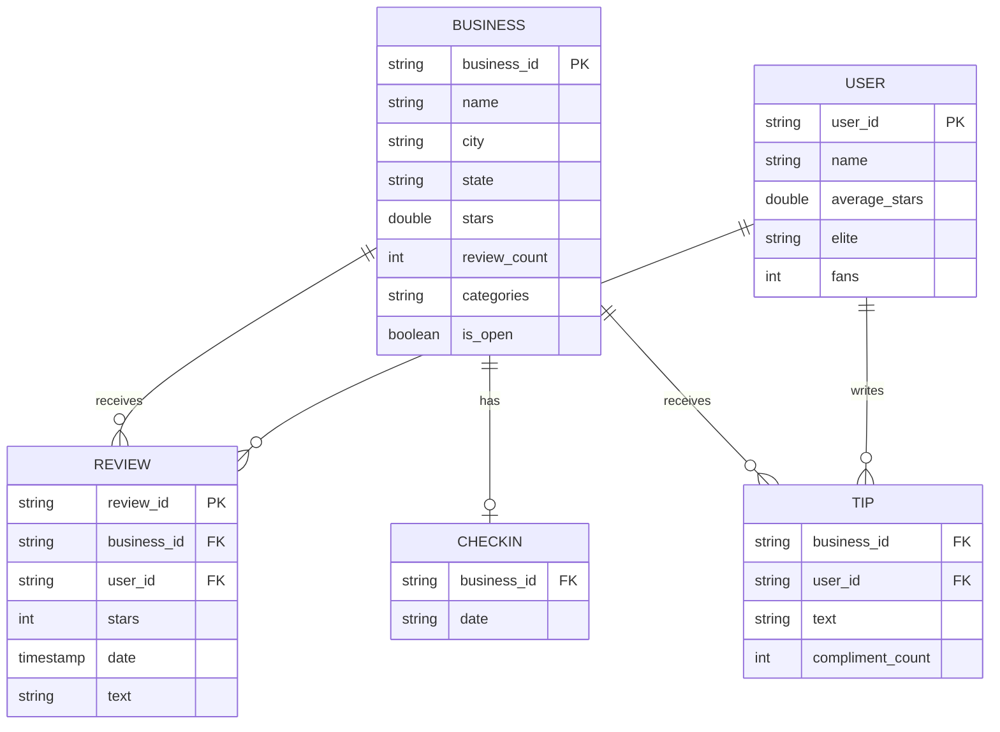
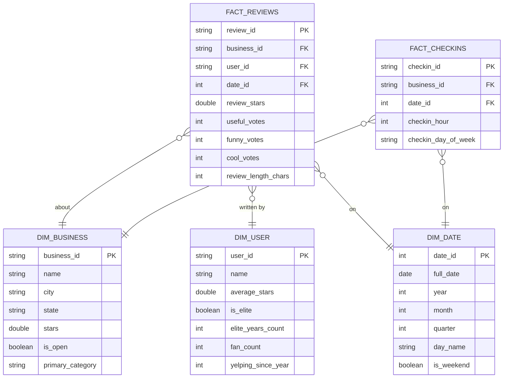

# Entity Relationship Diagram
## Yelp Dataset — Source Data Model & Gold Star Schema

---

## Source ERD — 5 Raw Entities

**Business is the root entity.** Every other entity references it via `business_id`. Review sits at the intersection of Business and User — it is the primary analytical fact.

---

## Gold Star Schema ERD

---

*Source ERD → raw Yelp JSON shape. Gold ERD → what the BI team queries.*