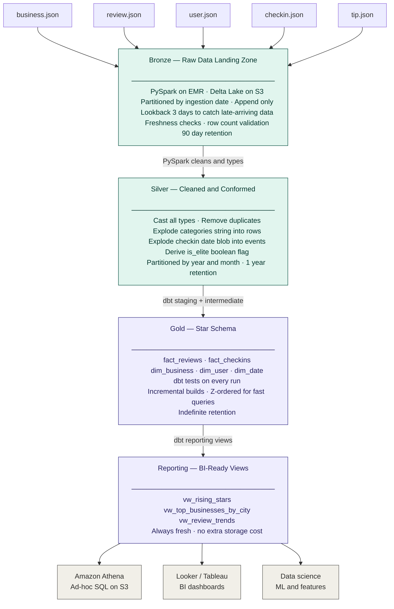
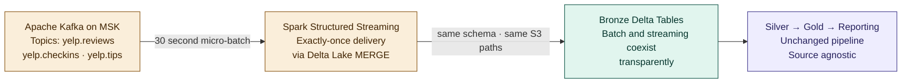

# Data Flow Diagram
## Yelp Data Engineering Platform — End-to-End Data Movement

---

## Main Pipeline Flow

---

## Airflow Orchestration Chain

```mermaid
flowchart LR
    A["dag_bronze_ingestion
    06:00 UTC daily"] -->|"on SUCCESS"| B["dag_silver_transform
    triggered after Bronze"]
    B -->|"on SUCCESS"| C["dag_gold_dbt
    triggered after Silver"]
    C --> D[dbt run staging]
    D --> E[dbt run intermediate]
    E --> F[dbt run marts]
    F --> G[dbt run reporting]
    G --> H[dbt test]
    H --> I[dbt docs generate]

    style A fill:#EEEDFE,stroke:#3C3489,color:#26215C
    style B fill:#EEEDFE,stroke:#3C3489,color:#26215C
    style C fill:#EEEDFE,stroke:#3C3489,color:#26215C
```

> If any stage fails the chain stops. BI is never served stale or invalid data.

---

## Real-Time Extension — Kafka

---

*End of Data Flow Document*