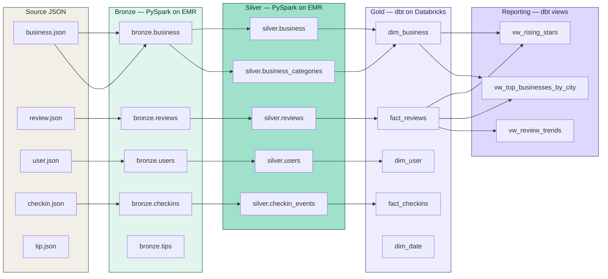
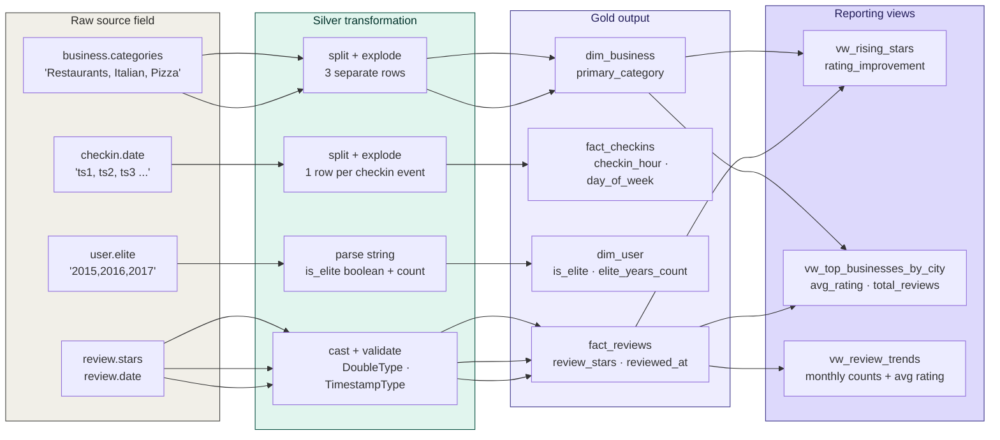
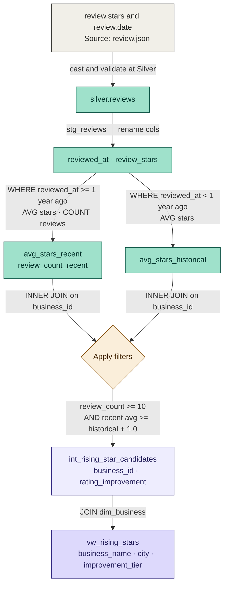

# Data Lineage
## Yelp Data Engineering Platform — Source to Reporting Traceability

---

## Table-Level Lineage

---

## Key Field Transformations

---

## Rising Star Metric — Full Lineage

---

*End of Data Lineage Document*