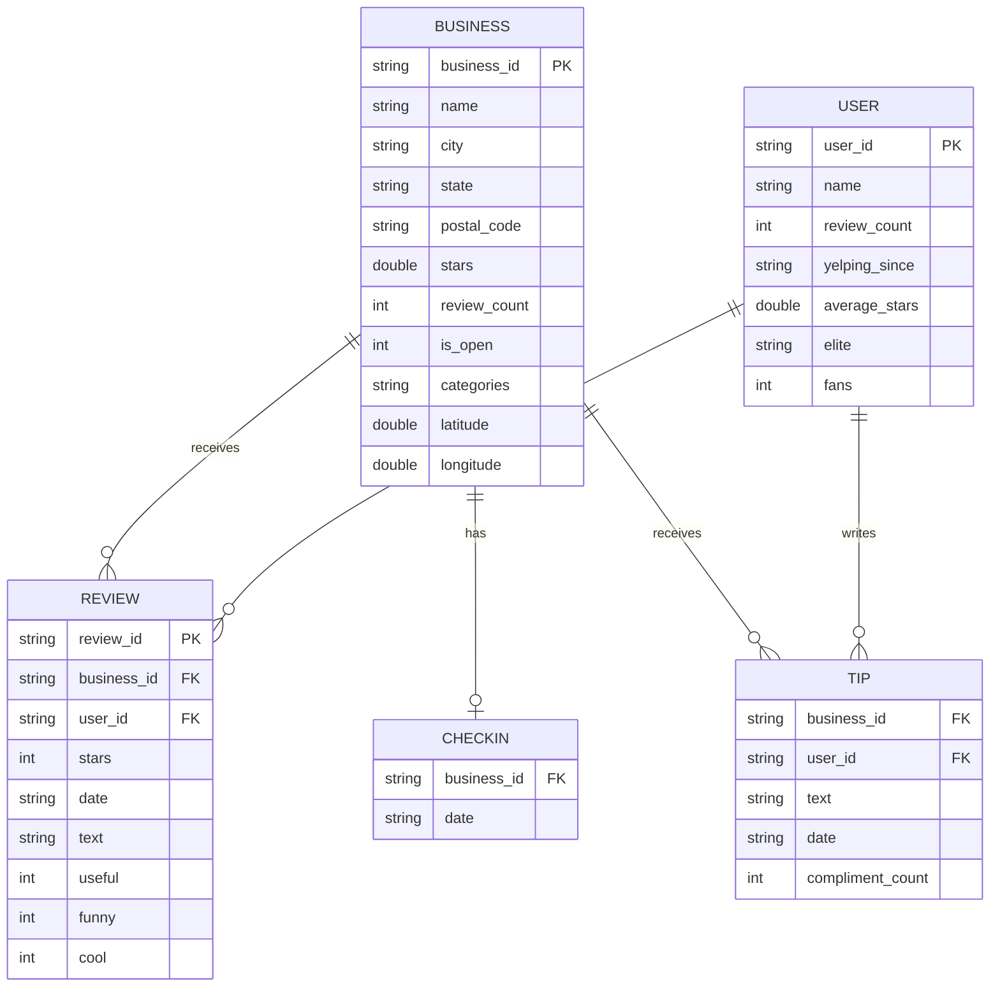
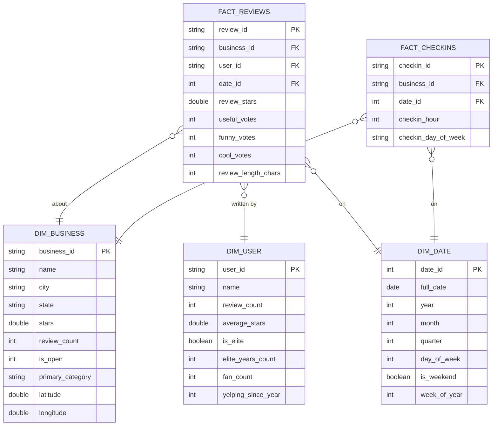

# Entity Relationship Diagram (ERD)
## Yelp Dataset — Source Data Model
**Author:** Aamir | **Version:** 1.0 | **Last Updated:** April 2026

---

> **Related Documents**
> - Full entity descriptions & field-level notes → `docs/data_model.md`
> - How the model evolves through Bronze/Silver/Gold → `docs/data_model.md` Section 5

---

## ERD — Source Layer (5 Entities)

---

## Reading the Diagram

### Cardinality Notation

| Symbol | Meaning |
|---|---|
| `\|\|` | Exactly one |
| `o\|` | Zero or one |
| `o{` | Zero or many |
| `\|{` | One or many |

### Key Relationships

**BUSINESS is the root entity.** Every other entity has a foreign key pointing to `business_id`. A business can receive many reviews, many tips, and has at most one checkin record.

**REVIEW is the primary fact.** It sits at the intersection of BUSINESS and USER — it is the only entity that references both. At ~6.9M rows it is the largest and most analytically valuable entity in the dataset.

**CHECKIN is one-to-one with BUSINESS** at the source level — there is one row per business containing all checkin timestamps as a denormalised comma-separated string. After Silver transformation, this becomes a one-to-many relationship (one business → many individual checkin event rows).

**TIP is a lightweight version of REVIEW** — it references both BUSINESS and USER but carries no star rating, only short text and a compliment count.

---

## Star Schema ERD — Gold Layer

After the Medallion pipeline runs, the data model is restructured into a Kimball star schema in the Gold layer. This is what the BI team queries.

---

## Key Design Decisions in the Gold Schema

**`categories` is not modelled as a dimension here** for simplicity. `primary_category` (the first category in the list) is denormalised directly into `dim_business`. For category-level drilling, a `bridge_business_categories` table is available in Silver and can be promoted to Gold if needed.

**`dim_date` is a date spine** — a pre-generated table of every calendar date with pre-computed attributes (quarter, day of week, is_weekend). This avoids repeated date function calls in BI queries and is a Kimball best practice.

**`fact_checkins.checkin_id`** is a surrogate key generated during the Silver transformation when the denormalised date string is exploded into individual rows.

**Referential integrity** between facts and dimensions is enforced by dbt `relationships` tests defined in `schema.yml` — not at the database level.

---

*End of ERD Document*